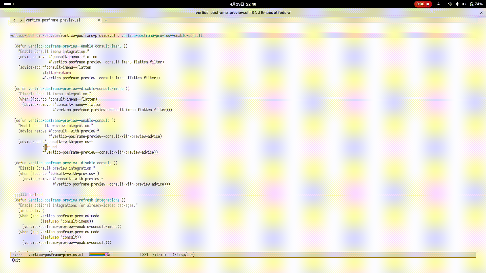
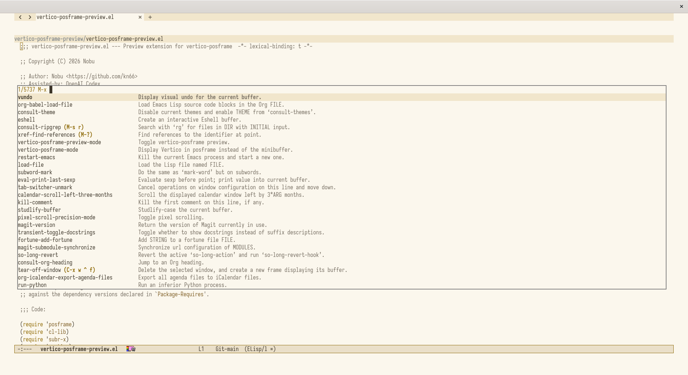
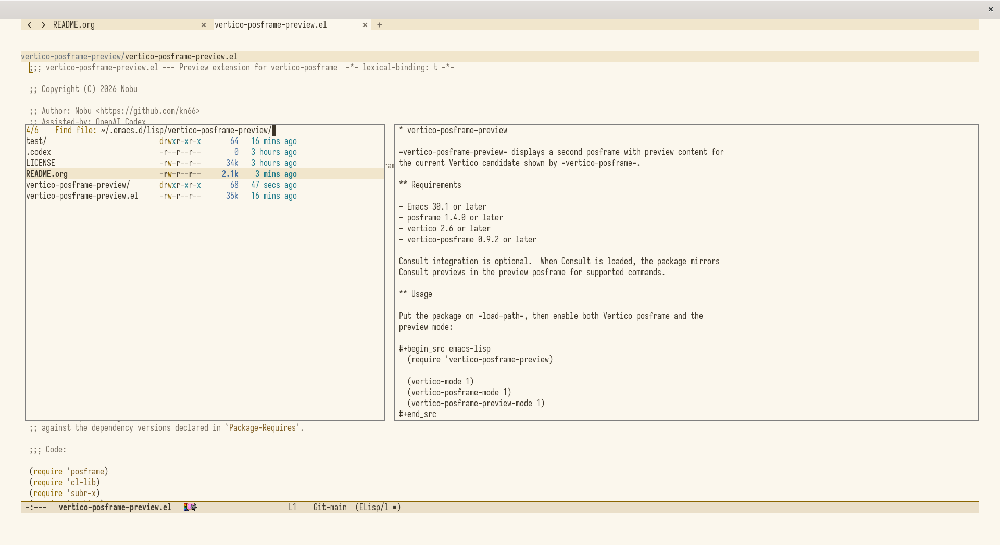
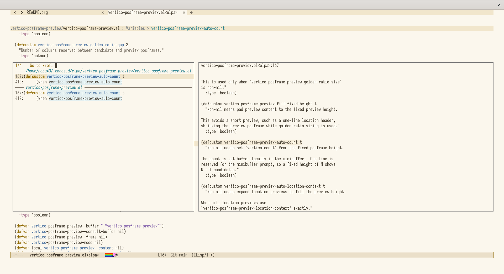
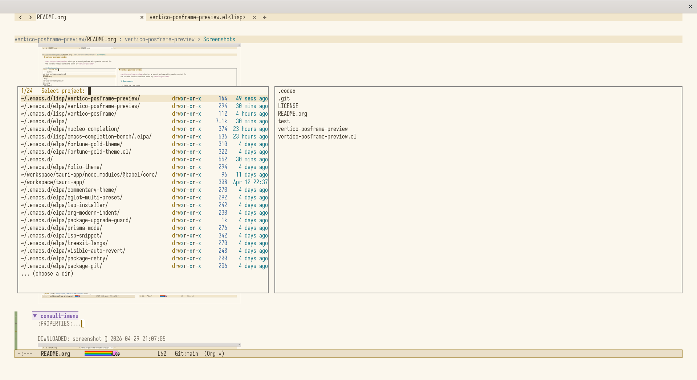
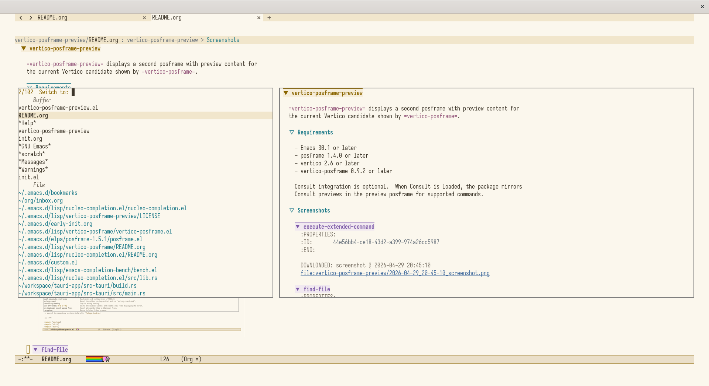
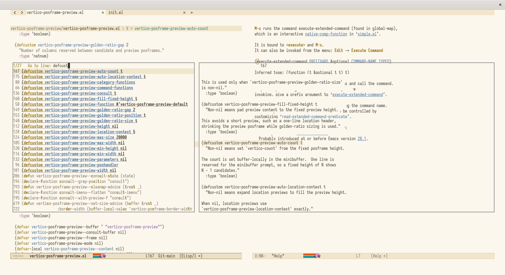
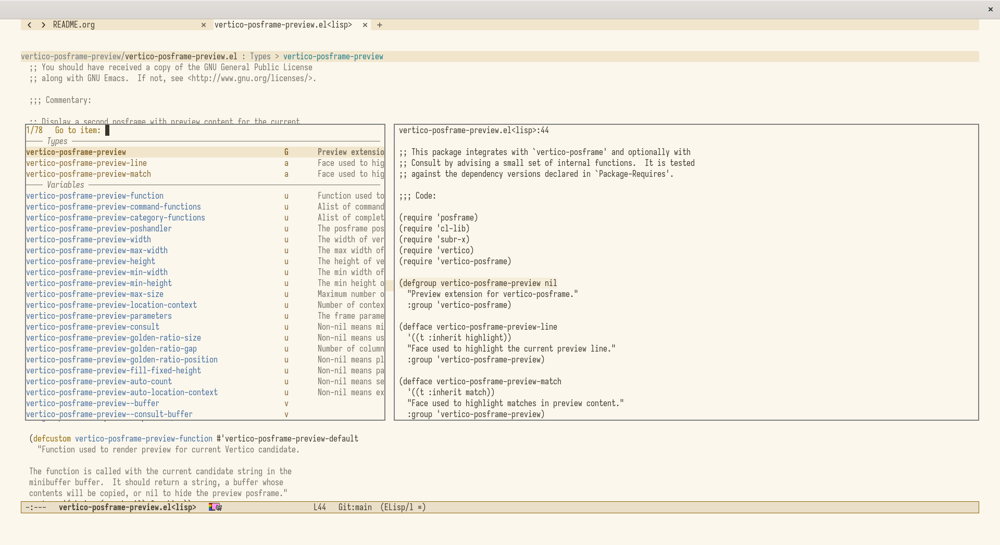

* vertico-posframe-preview

=vertico-posframe-preview= displays a second posframe with preview content for
the current Vertico candidate shown by =vertico-posframe=.

** Requirements

- Emacs 30.1 or later
- posframe 1.4.0 or later
- vertico 2.6 or later
- vertico-posframe 0.9.2 or later

Consult integration is optional.  When Consult is loaded, the package mirrors
Consult previews in the preview posframe for supported commands.

** GIF

** Screenshots

*** execute-extended-command
:PROPERTIES:
:ID:       44e56bb4-ce18-43d2-a399-974a26cc5987
:END:

#+DOWNLOADED: screenshot @ 2026-04-29 20:45:10

*** find-file
:PROPERTIES:
:ID:       f3541b86-6ca6-4d74-9c8b-f0d91eaa6488
:END:

#+DOWNLOADED: screenshot @ 2026-04-29 20:46:15

*** xref-find-references
:PROPERTIES:
:ID:       0841ef1a-c9d3-47b6-930c-f2b04290679e
:END:

#+DOWNLOADED: screenshot @ 2026-04-29 21:08:09

*** project-switch-project
:PROPERTIES:
:ID:       240df7d3-0c9a-4f65-976b-4d17ab7d239b
:END:

#+DOWNLOADED: screenshot @ 2026-04-29 21:10:33

*** consult-buffer
:PROPERTIES:
:ID:       ca3fbdf4-b943-4ea7-845f-422d3f813cdc
:END:

#+DOWNLOADED: screenshot @ 2026-04-29 20:47:55

*** consult-line
:PROPERTIES:
:ID:       3cd700c7-07ba-4026-9cef-dd27d6185df7
:END:

#+DOWNLOADED: screenshot @ 2026-04-29 20:48:44

*** consult-imenu
:PROPERTIES:
:ID:       b62b5e46-f8a2-4af6-9fca-c456fb0a8638
:END:

#+DOWNLOADED: screenshot @ 2026-04-29 21:07:05

** Note on the Demo Setup

The screenshots and GIF also use [[https://github.com/kn66/nucleo-completion.el][nucleo-completion.el]] for fuzzy matching.
It uses a dynamic module for fast scoring, with prebuilt modules available for
immediate use.  High-scoring candidates are highlighted with bold and underline,
which makes useful items easier to spot in large completion lists.

** Usage

Put the package on =load-path=, then enable both Vertico posframe and the
preview mode:

#+begin_src emacs-lisp
  (require 'vertico-posframe-preview)

  (vertico-mode 1)
  (vertico-posframe-mode 1)
  (vertico-posframe-preview-mode 1)
#+end_src

To toggle preview visibility during a Vertico session, bind
=vertico-posframe-preview-toggle= in =vertico-map=:

#+begin_src emacs-lisp
  (keymap-set vertico-map "C-t" #'vertico-posframe-preview-toggle)
#+end_src

Enable =vertico-posframe-preview-mode= after Consult has loaded if you want
Consult preview mirroring.  If Consult is loaded later, call:

#+begin_src emacs-lisp
  (vertico-posframe-preview-refresh-integrations)
#+end_src

The default preview function supports common file, buffer, location, grep,
imenu, and xref candidates.  Customize
=vertico-posframe-preview-category-functions= or
=vertico-posframe-preview-command-functions= to add command-specific previews.

** Compatibility Notes

This package intentionally advises private APIs from =vertico-posframe= and
Consult in order to place and synchronize the preview frame:

- =vertico-posframe--show=
- =vertico-posframe--minibuffer-exit-hook=
- =vertico-posframe-cleanup=
- =consult--with-preview-f=
- =consult-imenu--flatten=

Those functions are not stable public APIs.  If a dependency changes one of
these internals, this package may need an update even when byte compilation
still succeeds.  The dependency versions in the package header are the tested
baseline.

=vertico-grid= may not work well with this package.  The preview layout assumes
a single candidate list posframe placed next to a preview posframe, while
=vertico-grid= changes how candidates are arranged.

** Tests

Run the unit tests with:

#+begin_src sh
  emacs --batch -Q \
        -L /path/to/posframe \
        -L /path/to/vertico \
        -L /path/to/vertico-posframe \
        -L . \
        -l test/vertico-posframe-preview-test.el \
        -f ert-run-tests-batch-and-exit
#+end_src

The tests cover non-graphical preview helpers.  Posframe placement should still
be checked manually in a graphical Emacs session.
